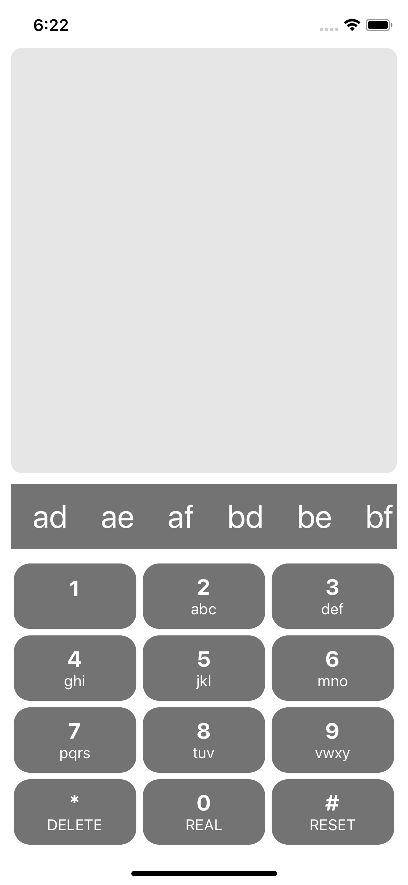

# kiwi-t9

React Native mobile app and Node.js server for T9 text suggestion.



## Server

### Run server

```
cd server
npm install
npm run dev
```

### Resource description

#### Suggestions

```
[GET] /suggestions
```

##### Parameters

- **numbers** _(required)_ — numbers to be converted to words suggestion
- **realWordsOnly** — if true, server will return only real words based on wordlist

###### Responses

`[GET] /suggestions?numbers=23`

**Code** 200

```js
["ad", "ae", "af", "bd", "be", "bf", "cd", "ce", "cf"]
```

`[GET] /suggestions?numbers=43556&realWordsOnly=true`

**Code** 200

```js
["hello"]
```

`[GET] /suggestions`

**Code** 400

```
Numbers is a required parameter.
```

`[GET] /suggestions?numbers=222222222222222222`

**Code** 400

```
Numbers numbers can only contain digits 2-9, maximum length is 10.
```

### Test server

```
cd server
npm run test
```

## Client

### Run client

```
cd client
yarn
react-native run-ios
```

### Test client

```
cd client
yarn test
```

## Possible future improvements

- Add support for more languages
- Add note if no real word found
- Add activity indicator
- Signalize whether real words mode is on
